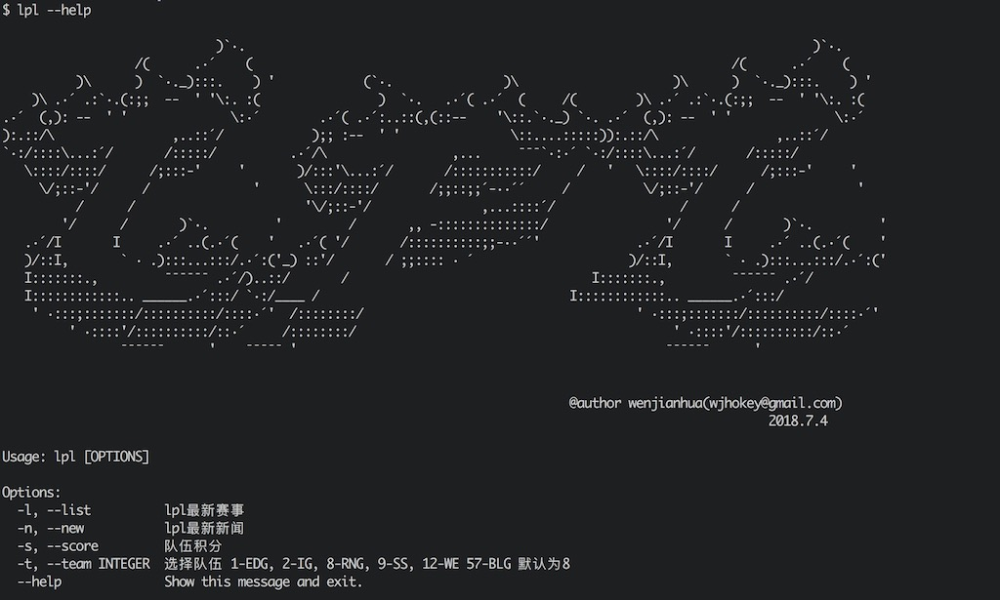

# lpl

英雄联盟(lol)职业联赛命令行

英雄联盟职业联赛，简称“LPL”，是《英雄联盟》中国大陆地区的顶级职业联赛。 英雄联盟职业联赛目前共有14支队伍参与，每年进行春季赛和夏季赛两次联赛，每次联赛分为常规赛、季后赛两部分。


```
 ___        ________   ___          
|\  \      |\   __  \ |\  \         
\ \  \     \ \  \|\  \\ \  \        
 \ \  \     \ \   ____\\ \  \       
  \ \  \____ \ \  \___| \ \  \____  
   \ \_______\\ \__\     \ \_______\
    \|_______| \|__|      \|_______|  

```


## Quick start
```shell
pip3 install lpl
```


## 使用方法
### 查看比赛
```lpl -l``` 或  ```lpl --list``` 查看比赛的列表

### 查看比赛相关新闻
```lpl -n``` 或 ```lpl --news``` 查看比赛新闻，默认为RNG，查看其他队伍的新闻需加上``` -t ```参数选择队伍

### 查看队伍积分

```lpl -s``` 或 ```lpl --score```查看比赛近况

### 选择队伍
```lpl -t``` 或 ```lpl --team``` 选择队伍，例如：```lpl -t 1```为选择队伍1

### 查看帮助
```python3 lpl.py --help``` 可查看队伍列表


## Screen shot




## To Do List

- 新功能开发


## CHANGELOG

[CHANGELOG](https://github.com/wjhtime/lpl/releases)


## License

[MIT](https://github.com/wjhtime/lpl/blob/master/LICENSE)


