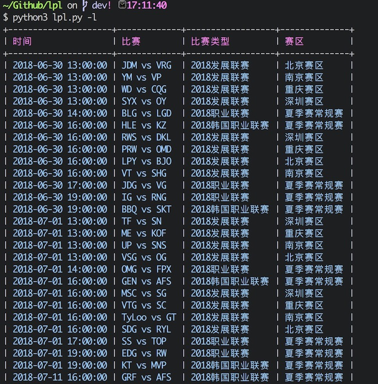
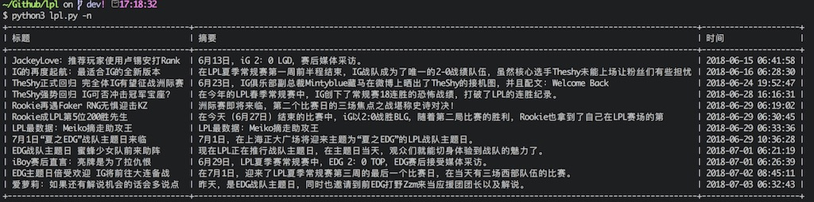

# lpl

英雄联盟(lol)职业联赛命令行


## Quick start
```shell
pip3 install -r requirements.txt
```


## 使用方法
### 查看比赛
```python3 lpl.py -l```或 ```python3 lpl.py --list```

### 查看比赛相关新闻
```python3 lpl.py -n```或```python3 lpl.py --news```

### 查看帮助
```python3 lpl.py --help```


## Screen shot
### 比赛列表



### 比赛相关新闻




## To Do List

- 新功能开发


## CHANGELOG

[CHANGELOG](https://github.com/wjhtime/lpl/releases)


## License

[MIT](https://github.com/wjhtime/lpl/blob/master/LICENSE)


